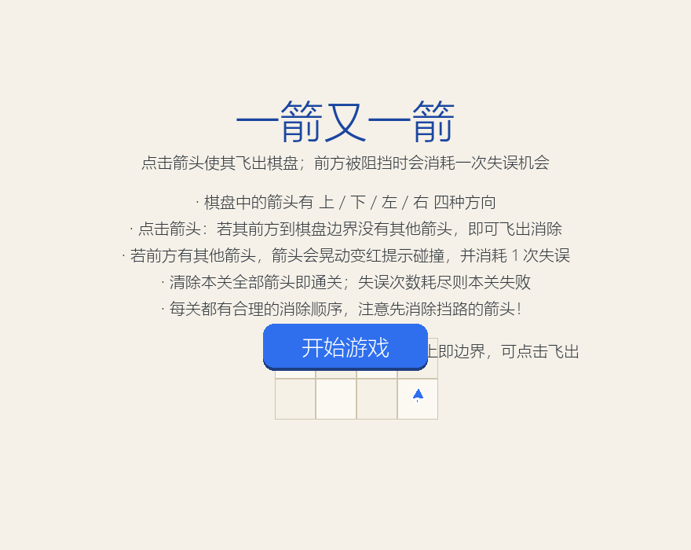
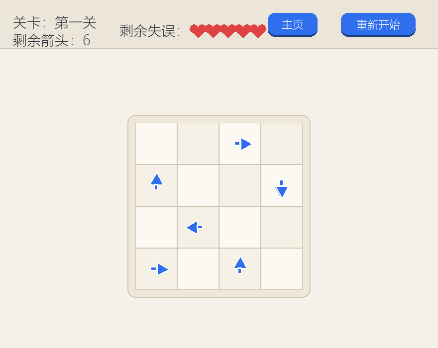
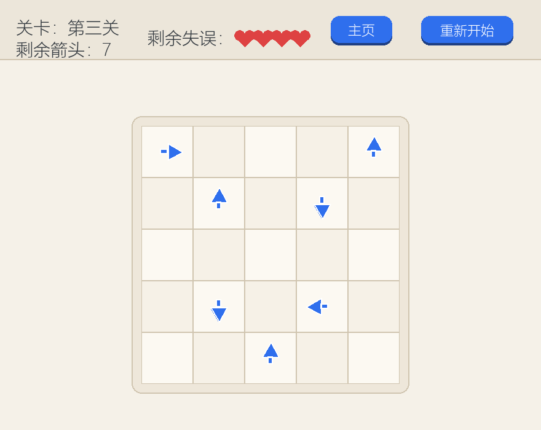
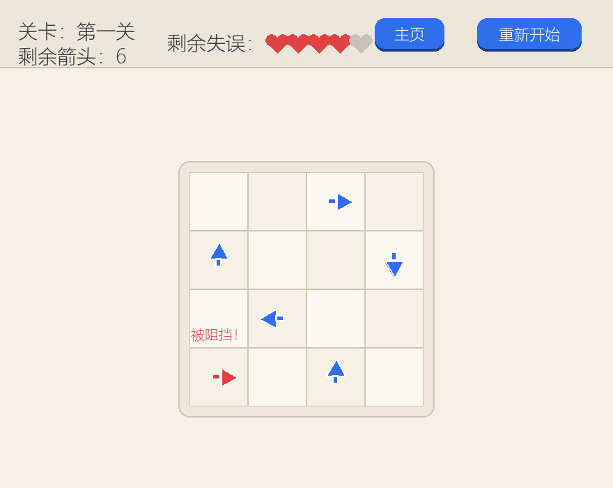
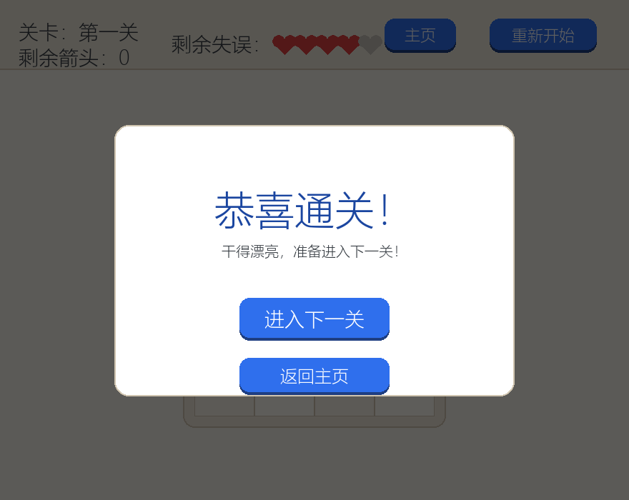
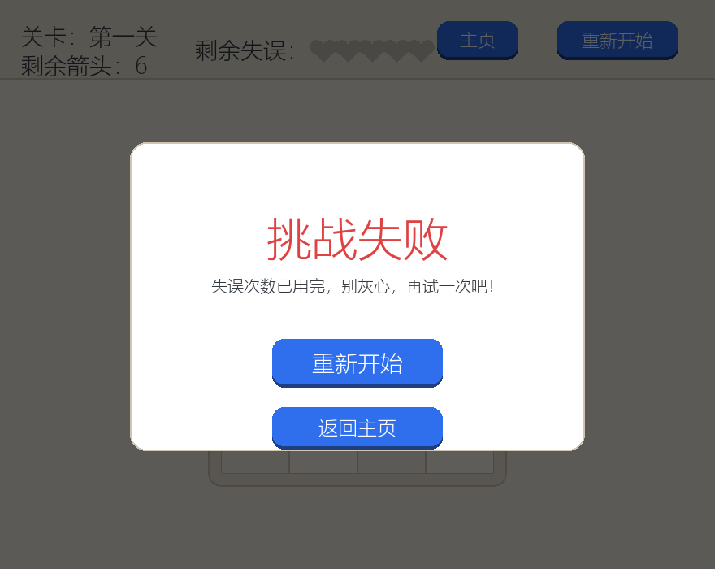
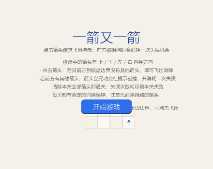

# 一箭又一箭（Arrow After Arrow）

一个使用 **Python + Pygame** 编写的点击式箭头解谜小游戏。玩家需要观察棋盘上各个箭头的方向与相互阻挡关系，按照合理的顺序点击箭头，让所有箭头依次飞出棋盘。

> 本作业只参考微信小游戏《一箭又一箭》的核心玩法，未使用其任何素材、代码或关卡，全部代码与关卡均为原创。开发过程中借助了 AIGC 工具（ deepseek）辅助需求分析、代码编写、关卡设计与调试。

## 游戏简介

- 棋盘中的箭头分为 **上 / 下 / 左 / 右** 四种方向；
- 点击一个箭头：若其**前方（到棋盘边界之间）没有其他箭头**，箭头会沿方向加速飞出棋盘并被消除；
- 若前方有其他箭头，箭头会**晃动、变红闪烁**并提示“被阻挡！”，同时**消耗 1 次失误机会**；
- 清除本关全部箭头即通关，自动进入下一关；失误次数耗尽则本关失败；
- 内置 **3 个可通关关卡**，每关都有“重新开始”按钮，可随时恢复本关初始状态。

## 开发环境

| 项目 | 说明 |
| --- | --- |
| 操作系统 | Windows 10/11（其他平台亦可运行） |
| 语言 | Python 3.10+（开发验证于 Python 3.14） |
| 图形库 | pygame-ce >= 2.5.0（Python 3.13+ 请使用 pygame-ce，它提供新版 Python 的预编译包；Python ≤ 3.12 亦可使用官方 pygame） |
| 其他依赖 | 无（截图/演示脚本额外使用 Pillow，仅开发用） |

## 安装和运行方法

**最简单的方式（Windows）：直接双击项目里的 `启动游戏.bat`**，脚本会自动定位可用的 Python 并补齐依赖，然后弹出游戏窗口。

命令行方式：

```bash
# 1. 克隆或下载本项目
git clone <仓库地址>
cd arrow-game

# 2. （推荐）创建虚拟环境
python -m venv .venv
# Windows
.venv\Scripts\activate
# macOS / Linux
source .venv/bin/activate

# 3. 安装依赖
pip install -r requirements.txt
# 国内网络可使用清华镜像加速：pip install -r requirements.txt -i https://pypi.tuna.tsinghua.edu.cn/simple

# 4. 运行游戏
python main.py
```

> **Windows 提示**：如果命令行执行 `python main.py` 后没有任何反应，通常是 `python` 命令指向了系统自带的空壳别名（`WindowsApps` 下的 0 字节文件），并非真实 Python。此时请直接双击 `启动游戏.bat`，或在 PowerShell 中用已安装 Python 的完整路径运行，例如：
>
> ```powershell
> & "C:\Users\<用户名>\AppData\Local\Doubao\User Data\sandbox_runtime\bases\<版本目录>\python\python.exe" main.py
> ```
>
> 若使用 Python 3.13 及以上版本，请安装 `pygame-ce`（requirements.txt 已指定）；若使用 Python ≤ 3.12 且更习惯官方包，也可 `pip install pygame` 后运行。

## 游戏操作说明

- **鼠标左键**点击箭头进行消除；
- **开始界面**：点击“开始游戏”进入第一关；
- **游戏界面**（顶部信息栏）：
  - 左侧：当前关卡、剩余箭头数量；
  - 中间：剩余失误次数（红色爱心，点空会变灰）；
  - 右侧：“主页”“重新开始”按钮；
- **通关界面**：点击“进入下一关”继续，通关第三关后可“再玩一次”；
- **失败界面**：点击“重新开始”重试本关，或“返回主页”；
- 游戏过程中按 **Esc** 键可返回开始界面。

## 项目结构

```
arrow-game/
├── main.py                 # 游戏主程序（pygame 界面、动画、事件与主循环）
├── game_logic.py           # 核心逻辑（方向/路径检测、消除、失误、求解器），不依赖 pygame
├── levels.py               # 关卡数据（3 关）
├── tests.py                # 自动化测试（对应作业测试用例 T01~T06）
├── tools/
│   └── make_screenshots.py # 离屏渲染截图与通关演示 GIF 生成脚本
├── docs/
│   └── game-flow.html      # 游戏流程与代码架构图
├── screenshots/            # 游戏截图与演示 GIF
├── requirements.txt
└── README.md
```

游戏状态流程与代码架构：[游戏流程与架构图](docs/game-flow.html)

## 运行测试

```bash
python tests.py
```

测试覆盖：四方向路径检测、边缘箭头越界处理、点击消除、碰撞与失误扣减、通关/失败状态、重新开始恢复、关卡可解性校验。

## 游戏截图

开始界面：



游戏界面（第一关 / 第三关）：

 

碰撞反馈：



通关与失败界面：

 

通关演示（GIF）：



## 说明

- 本项目为课程作业“利用 AIGC 完成‘一箭又一箭’小游戏”的交付代码；
- 开发过程中使用 AIGC 工具（deepseek）辅助：代码结构设计、路径检测逻辑、关卡生成与修正、界面与动画实现、测试用例编写等，具体协作记录见课程博客；
- 未使用任何第三方商业游戏素材，游戏中的图形均为 Pygame 原生绘制。
